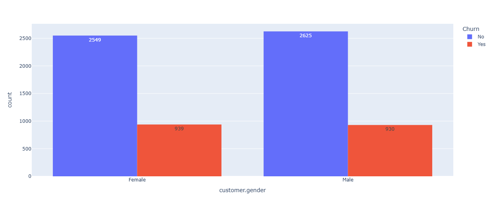
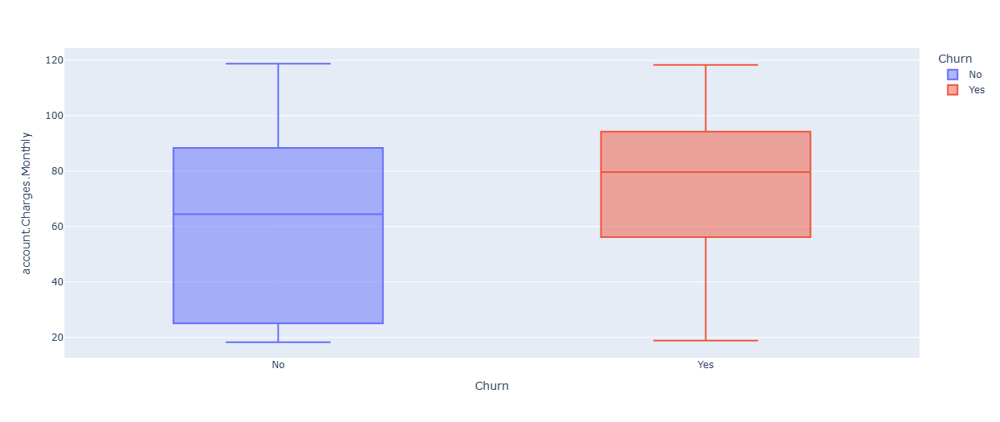
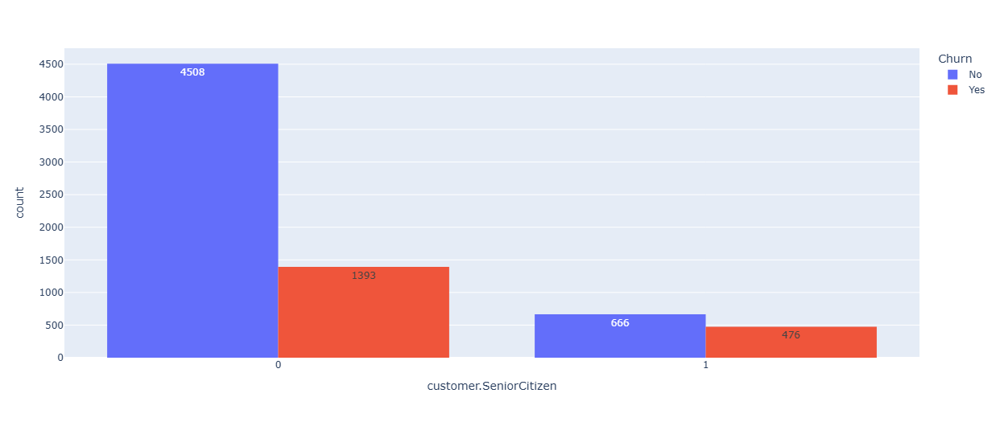

# 📞 Telecom X - Análisis de Evasión de Clientes (Churn Analysis)

## 📌 **Propósito del Proyecto**

Este proyecto fue desarrollado como parte del desafío de análisis de datos de **Telecom X**, una empresa de telecomunicaciones con una alta tasa de cancelación de clientes.

El objetivo principal es **entender los factores que influyen en la pérdida de clientes (churn)** a través de un análisis exploratorio de datos (EDA), utilizando Python y bibliotecas de ciencia de datos como `pandas`, `seaborn`, `matplotlib` y `scikit-learn`.

A partir de este análisis, se generan insights estratégicos que servirán como base para el desarrollo de **modelos predictivos de churn** y **estrategias de retención**.

---

## 📁 **Estructura del Proyecto**

- `TelecomX01_LATAM.ipynb`: Notebook principal con todo el flujo del análisis.
- `README.md`: Documento descriptivo del proyecto.
- `imgs/`: Carpeta (opcional) para almacenar las visualizaciones generadas durante el análisis.
- Datos obtenidos desde una API, tratados y transformados dentro del mismo notebook.

## 📊 **Gráficos e Insights Obtenidos**

Durante el Análisis Exploratorio de Datos (EDA), se identificaron patrones importantes que ayudan a entender el comportamiento de los clientes que cancelan el servicio.

---

### 1. Churn por Género

🔹 **Insight**: No hay diferencias significativas en la tasa de cancelación entre hombres y mujeres.

---

### 2. Cargos Mensuales vs Churn

🔹 **Insight**: Los clientes que cancelan el servicio tienden a tener cargos mensuales más altos en promedio.

---

### 3. Churn por Adultos Mayores

🔹 **Insight**: Aunque los adultos mayores son menos en cantidad, su proporción de cancelación es mayor respecto al resto de los clientes.

---

## 🚀 **Instrucciones para ejecutar el Notebook**

1. Descarga el archivo `TelecomX01_LATAM.ipynb`.
2. Súbelo a [Google Colab](https://colab.research.google.com/).
3. Selecciona **"Ejecutar todo"** para reproducir el análisis completo.

## ¿Te gustó este proyecto?

Si este proyecto te ha resultado útil, ¡apóyalo dejando una ⭐ en el repositorio!